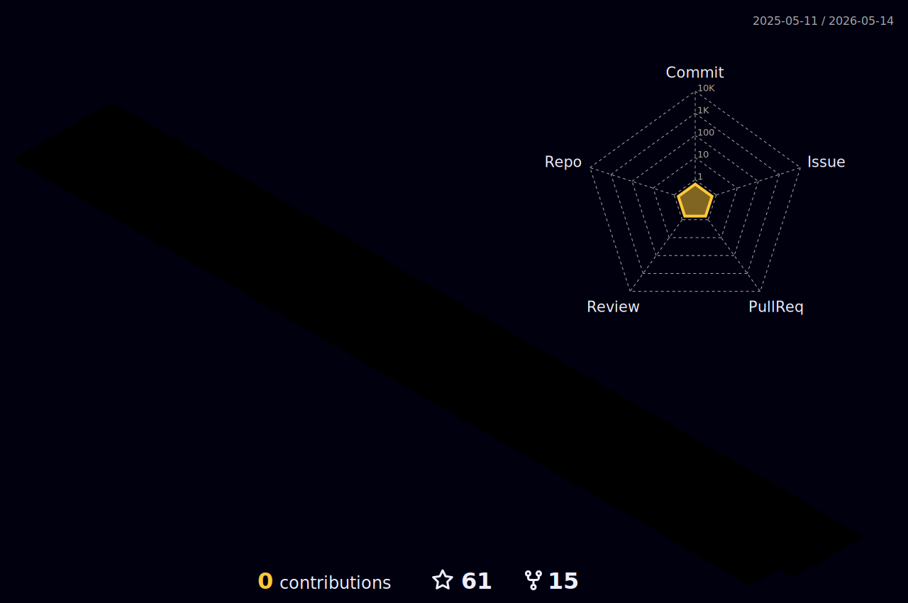

# Usama Shehab
### Backend Engineer · Python / Django · Performance Optimization

---

## 👨‍💻 About Me

Backend Engineer with **4+ years** building scalable, high-performance backend services in **Python, Django, and Django REST Framework** on PostgreSQL, including multi-tenant SaaS platforms.

- 🏢 Currently working at **Smart Performance Management (SPM)** — Full-Time, Remote
- 🚀 Hands-on with **payment integrations (Stripe)**, secure authentication, and real-time systems
- 🌍 Open to **remote opportunities** globally
- 💡 Passionate about **clean architecture**, config-driven systems, and performance optimization

---

## 🛠️ Technical Skills

**Languages & Frameworks**

<code></code>
<code></code>
<code></code>
<code></code>
<code></code>

**Databases & Infrastructure**

<code></code>
<code></code>
<code></code>

| Area | Skills |
|------|--------|
| **Languages & Frameworks** | Python, Django, Django REST Framework, Django Channels, Celery |
| **Databases & Caching** | PostgreSQL (schema design, indexing, query optimization), Redis |
| **Payments & Integrations** | Stripe payment integration, payment-flow design, third-party / fintech API integration |
| **APIs & Architecture** | RESTful API design, tenant-aware development (django-tenants), WebSockets, real-time systems, registry / provider patterns, microservices |
| **Performance & Scalability** | ORM optimization, query prefetching, caching strategies, async processing, load profiling (Django Silk) |
| **Security** | Two-step OTP authentication, secure WebSocket middleware, single-use token (UUID) flows |
| **Tools & Practices** | Git, Docker, clean architecture, code reviews, performance profiling |

---

## 💼 Professional Experience

### 🏢 Backend Engineer — Smart Performance Management (SPM)
**May 2024 – Present · Sheridan, USA · Full-Time, Remote**
> Multi-tenant SPM/PPM SaaS (Django 5.2, DRF, PostgreSQL)

- 🔧 **Config-driven calculation engine** — replaced hard-coded business logic with 220+ database-defined formulas, using AST-based safe evaluation, a pluggable data-provider registry, and dual collection modes — behavior adapts per tenant without code changes
- ⚡ **Cascading recalculation engine** — field-level change detection propagates only to affected dependents (with depth limiting), paired with reverse-dependency mapping and auto-built prefetch to eliminate N+1 queries
- 🌲 **Generic tree API** — tenant-aware registry, automatic prefetch-depth detection, and cross-worker cache invalidation consolidating multiple bespoke endpoints into one configurable service
- 🔐 **Declarative row-level access-control layer** — single configuration map secures any model, enforcing role-based visibility across the data model without per-endpoint code
- 📊 **Declarative dashboard-card framework** — multi-stage, multi-layout cards bound to the calculation engine with bulk-fetched results and tenant-scoped caching
- 📈 **Performance profiling** — optimized ORM usage, query prefetching, and caching across core modules using Django Silk

---

### 🏢 Software Engineer — Infinity Wave
**Jul 2023 – May 2024 · Johor, Malaysia · Full-Time, Remote**

- 📡 Built a **real-time notification system** and WebSocket integrations (Django Channels)
- 📋 Delivered a **Permit-to-Work (PTW) module** to streamline permit workflows and compliance
- 🗂️ Designed **project-management features** for planning, tracking, and execution
- 🔄 Enhanced **asset management** with Business Central 365 (BC365) data synchronization
- ⚙️ Applied **performance optimizations** to support higher load and better responsiveness

---

### 🏢 Backend Engineer — TaxiTR
**Oct 2022 – Jul 2023 · Montreal, Canada · Full-Time, Remote**

- 💳 **Stripe integration** — secure in-app payments serving thousands of users
- 🔐 **Two-step OTP authentication** and secure WebSocket middleware using single-use UUIDs
- 🚖 **Real-time driver tracking** and analytics (speed, earnings, performance) via Django Channels
- 🗺️ **Efficient dispatch system** to optimize trip assignment and reduce response times
- 📈 Improved backend reliability and scalability with async processing patterns

---

## 🚀 Selected Projects

| Project | Description |
|---------|-------------|
| **TaxiTR — Ride-Hailing Platform** | Backend in DRF & Django Channels with Stripe payments, real-time tracking, and dispatch — serving thousands of users |
| **Smart Performance Management (SPM)** | Multi-tenant SaaS built around config-driven engines: database-defined formula/score engine, generic tree API, declarative dashboard cards, and centralized row-level access-control |
| **E-commerce Price Comparison** | Scalable backend comparing prices across multiple vendors with full-text search and advanced filtering |
| **Fox (PTW & Asset Management)** | Led backend development automating safety/health permit workflows, approvals, and asset management with BC365 data sync |

---

## 🎓 Education

**B.Sc. in Computer Engineering — Mansoura University**
> Grade: **Excellent with Honors** · Graduation Project: **Excellent**

---

## 📊 GitHub Stats

  
  
  

  

---

*"Building systems that adapt, scale, and endure."*

